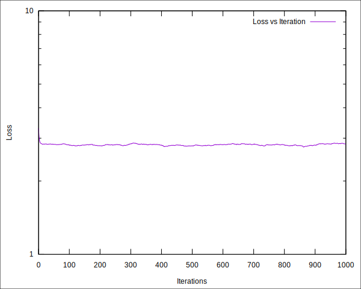

# makemore-cpp-2023

A C++ implementation of
[karpathy/makemore](https://github.com/karpathy/makemore).
Each step of the second episode of *Neural Nets: Zero to Hero*:
[The spelled-out intro to language modeling: building makemore](
https://youtu.be/PaCmpygFfXo)
is included.

   - [Loss Plot](#loss-plot)

## Bigram Language Model

### matplotlib-cpp

[Cryoris/matplotlib-cpp](https://github.com/Cryoris/matplotlib-cpp)

### Bigram Frequencies


### Loss Plot

We can plot the loss values over iterations using [loss_plot.gp](loss_plot.gp):

```gnuplot
set logscale y
set xlabel "Iterations"
set ylabel "Loss"
set terminal svg
set output "loss.svg"
set object 1 rect from screen 0,0 to screen 1,1 behind fillcolor rgb "white" fillstyle solid 1.0
plot "loss.tsv" using 1:2 with lines title "Loss vs Iteration"
```

```bash
$ gnuplot loss_plot.gp
```



This shows the loss reduction during training.

