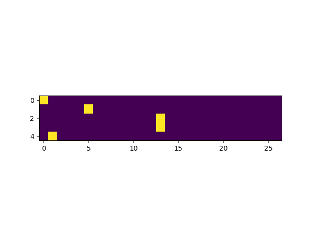

[](https://github.com/kfish/makemore-cpp-2023/actions/workflows/cmake.yml)

# makemore-cpp-2023

A C++ implementation of
[karpathy/makemore](https://github.com/karpathy/makemore).
Each step of the second episode of *Neural Nets: Zero to Hero*:
[The spelled-out intro to language modeling: building makemore](
https://youtu.be/PaCmpygFfXo)
is included.

 * [Bigram Language Model](#bigram-language-model)
   - [matplotlib-cpp](#matplotlib-cpp)
   - [Bigram Frequencies](#bigram-frequencies)
   - [Multinomial Sampler](#multinomial-sampler)
   - [Broadcasting Rules](#broadcasting-rules)

 * [The Neural Network Approach](#the-neural-network-approach)
   - [OneHot Encoding](#onehot-encoding)
   - [LogitLayer](#logitlayer)
   - [Smoothing](#smoothing)
   - [Sampling](#sampling)

## Bigram Language Model

### matplotlib-cpp

[Cryoris/matplotlib-cpp](https://github.com/Cryoris/matplotlib-cpp)

```bash
$ sudo apt update
$ sudo apt install python3 python3-dev python3-matplotlib
```

### Bigram Frequencies


### Multinomial Sampler

### Broadcasting Rules

[Reductions, visitors and Broadcasting](https://eigen.tuxfamily.org/dox/group__TutorialReductionsVisitorsBroadcasting.html)

## The Neural Network Approach

### OneHot Encoding

```c++
static inline Eigen::VectorXd encode_onehot(char c) {
    return OneHot(27, c_to_i(c));
}

static inline Eigen::MatrixXd encode_onehot(const std::string& word) {
    Eigen::MatrixXd matrix(word.size(), 27);

    for (size_t i = 0; i < word.size(); ++i) {
        matrix.row(i) = encode_onehot(tolower(word[i]));
    }

    return matrix;
}

```

We can encode the input string `".emma"` (including start token `'.'`)
and visualize this to make it a little more clear:

```c++
    std::string xs = ".emma";

    auto xenc = encode_onehot(xs);

    plt::imshow(xenc);
```



### LogitLayer

### Smoothing

Incentivize W to be near zero

square and sum all entries: zero loss if W near zero

### Sampling

Extract probability matrix, use multinomial sampler
