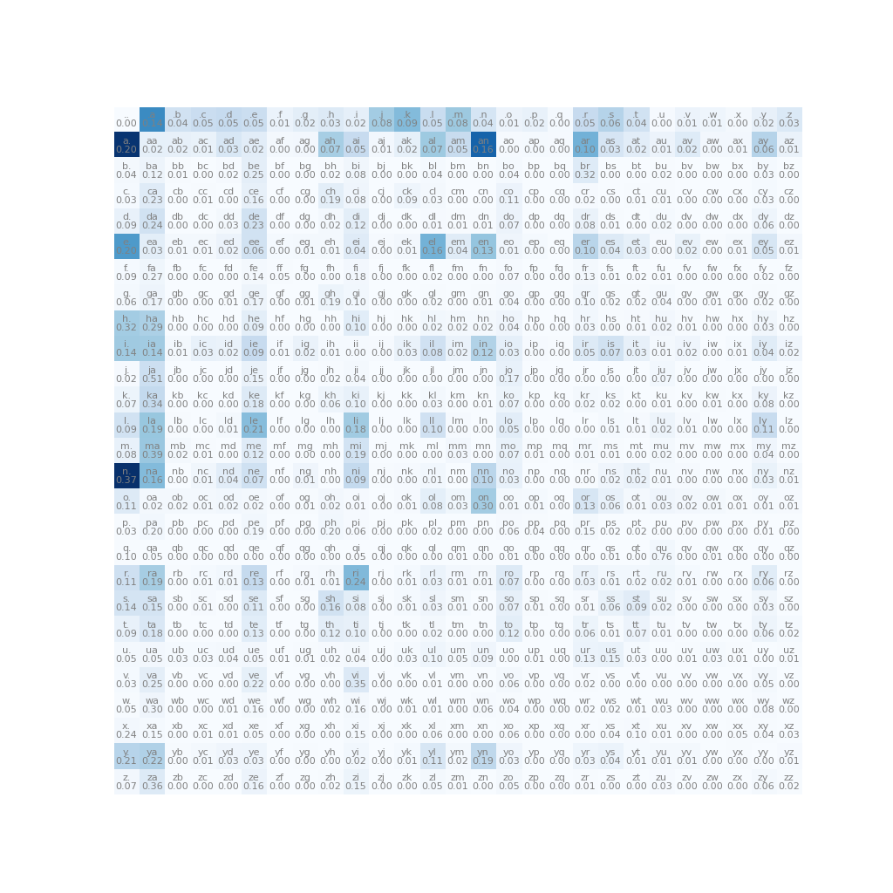

[](https://github.com/kfish/makemore-cpp-2023/actions/workflows/cmake.yml)

# makemore-cpp-2023

A C++ implementation of
[karpathy/makemore](https://github.com/karpathy/makemore), a toy system for generative AI.

Over a series of videos, episodes 2-5 of *Neural Nets: Zero to Hero*, Andrej Karpathy
details how to build a simple generative model.
This repository follows the thread of these videos, with the aim of developing a
corresponding platform in C++. This platform includes reusable code for:
  * building larger models that can be trained via backpropagation
  * visualization of matrices and plots of training data
  * training and sampling from models

These steps are essential for doing research on neural nets, so that the full cycle of
trying out ideas and evaluating them can be done with a few lines of code.

---

# Episode 1

*Building micrograd* spelled out backpropagation and training of neural nets.
I implemented a C++ version of that in
[kfish/micrograd-cpp-2023](https://github.com/kfish/micrograd-cpp-2023).

This repository (makemore-cpp-2023) continues on from there, expanding the automatically
differentiable `Value<T>` object to use vector and matrix operations.
This extension is crucial for applying automatic differentiation in a broader context.

# Episode 2


Each step of the second episode of *Neural Nets: Zero to Hero*:
[The spelled-out intro to language modeling: building makemore](
https://youtu.be/PaCmpygFfXo)
is included.

 * [Intro](#intro)
 * [Bigram Language Model](#bigram-language-model)
   - [Eigen](#eigen)
   - [matplotlib-cpp](#matplotlib-cpp)
   - [Bigram Frequencies](#bigram-frequencies)
   - [Multinomial Sampler](#multinomial-sampler)
   - [Loss function](#loss-function)
   - [Broadcasting Rules](#broadcasting-rules)

 * [The Neural Network Approach](#the-neural-network-approach)
   - [OneHot Encoding](#onehot-encoding)
   - [LogitLayer](#logitlayer)
   - [LogitNode](#logitnode)
   - [LogitMLP](#logitmlp)
   - [Smoothing](#smoothing)
   - [Sampling](#sampling)

## Intro

makemore "makes more of things like what you give it".
What it generates is unique names, made from sequences of characters, one letter at a time.
It is trained on a large list of common names, [names.txt](names.txt).

To demonstrate the concept of building a model, training and evaluating it, we first make
a complete statistical model by counting often each pair of letters occurs.

We then replace the model itself with a neural network, and tweak that.

---

## Bigram Language Model

A bigram is a pair of "grams", which are grammatical dust, the smallest written things.
In this toy system we use individual letters, so our bigram model looks at pairs of letters.

The code in [examples/bigram.cpp](examples/bigram.cpp) constructs a Bigram Language Model, renders the table, and generates new names.

We start by counting how often each pair of letters occurs:


For example 4410 names start with the letter `a` , which we can prove to ourselves with grep:

```bash
$ grep -c ^a names.txt
4410
```

We can think of each row of the matrix as telling us what the likelihood of the next letter is. The top row
tells us the likelihood of the first letter in a name (`a` is more likely than `u`).
If we chose an `a`, the next letter is very likely to be `n` or `l`, and unlikely to be `q` or `o`.

We'll start with some code to put the frequencies of each pair ("bigram") into a matrix, and display that.

### Eigen

We're going to need to manipulate matrices of numbers. We won't need to do complex linear algebra here but
it is useful to be able to select rows and columns of numbers and apply logs and exponents to everything.
When we build out the neural net we'll do some matrix multiplications and transposes.

[Eigen](https://eigen.tuxfamily.org/index.php?title=Main_Page)
is a high-level C++ library for linear algebra, matrix and vector operations.
It can make use of vectorized CPU instructions so it's efficient enough to get started.

### matplotlib-cpp

matplotlib-cpp is a C++ wrapper around the Python matplotlib library.
This allows us to use the same visualizations that the machine learning community uses for research.

I've forked matplotlib-cpp with some small changes required:
[kfish/matplotlib-cpp](https://github.com/kfish/matplotlib-cpp)

In order to use this, you'll need to install some Python development packages, required for
linking C/C++ code against a Python interpreter:


```bash
$ sudo apt update
$ sudo apt install python3 python3-dev python3-matplotlib
```

> [!NOTE]
> Python will only be used for visualization: the core neural net training and
> sampling is all implemented in C++.

### Bigram Frequencies

We normalize (ie. divide by the sum of) each row to calculate the probability of subsequent letters:

```c++
Eigen::MatrixXd generate_probability_distributions(const Eigen::MatrixXd& freq_matrix) {
    Eigen::MatrixXd prob_matrix = freq_matrix; // Copy the matrix; will modify in place
    Eigen::VectorXd row_sums = freq_matrix.rowwise().sum(); // Sum along each row

    // Normalize each row
    for (int i = 0; i < freq_matrix.rows(); ++i) {
        if(row_sums(i) > 0) { // Guard against division by zero
            prob_matrix.row(i) /= row_sums(i);
        }
    }

    return prob_matrix;
}
```

and use matplotlib-cpp to generate a table of probabilities:

```c++
    plt::figure_size(1024, 1024);
    plt::imshow(bigram_freq, {{"cmap", "Blues"}});

    for (int i=0; i<27; ++i) {
        for (int j=0; j<27; ++j) {
            char label[3] = {i_to_c(i), i_to_c(j), '\0'};
            plt::text(j, i, label, {{"ha", "center"}, {"va", "bottom"}, {"color", "grey"}, {"fontsize", "8"}});

            double v = prob_matrix(i, j);
            std::string value = static_cast<std::ostringstream&&>(std::ostringstream() << std::fixed << std::setprecision(2) << v).str();

            plt::text(j, i, value, {{"ha", "center"}, {"va", "top"}, {"color", "grey"}, {"fontsize", "8"}});
        }
    }
```



### Multinomial Sampler

Finally we want to generate names. We do this by choosing each letter in turn, with likelihood given by the
previous letter's row of the probability matrix.

We interpret the row as a probability distribution and sample from that.
The C++ standard library provides some basic types for random number generation and using probability
distributions, in particular we use
[std::discrete_distribution](https://en.cppreference.com/w/cpp/numeric/random/discrete_distribution).


```c++
class MultinomialSampler {
private:
    std::vector<std::discrete_distribution<int>> distributions; // Cached distributions
    std::mt19937 rng; // Random number generator

    // Cache discrete_distribution instances for each row of the probability matrix
    void cache_distributions(const Eigen::MatrixXd& prob_matrix) {
        for (int i = 0; i < prob_matrix.rows(); ++i) {
            Eigen::VectorXd row = prob_matrix.row(i); // Force evaluation into a dense vector
            std::vector<double> prob_vector(row.data(), row.data() + row.size());
            std::discrete_distribution<int> dist(prob_vector.begin(), prob_vector.end());
            distributions.push_back(dist);
        }
    }

public:
    // Constructor that takes a precalculated probability matrix
    MultinomialSampler(const Eigen::MatrixXd& prob_matrix)
        : rng(static_mt19937())
    {
        cache_distributions(prob_matrix);
    }

    // Operator to sample given a row index
    size_t operator()(size_t row_idx) {
        if (row_idx >= distributions.size()) {
            throw std::out_of_range("Row index out of bounds");
        }

        // Use the pre-cached distribution to sample and return column index
        return distributions[row_idx](rng);
    }
};
```

Finally we can use this `MultinomialSampler` to generate names:

```c++
    auto multinomial = MultinomialSampler(prob_matrix);

    auto generate = [&]() {
        int ix = 0;
        do {
            ix = multinomial(ix);
            std::cout << i_to_c(ix);
        } while (ix);
        std::cout << std::endl;
    };

    for (int i=0; i<50; ++i) {
        generate();
    }
```

Which generates some new names:

```
$ examples/bigram ../names.txt
xsia.
atin.
yn.
cahakan.
eigoffi.
la.
wyn.
ana.
k.
tan.
...
```

We'd like to improve on this when we use a more complex model, and in order to do that we need to be able
to evaluate how good a model is and the contribution of each model parameter.

### Loss function

We invent a function that returns a number representing how bad the model is.
If we can tweak our parameters so that this number goes down, then we think we've improved our model.
This is loss.

The loss function compares our model output to the expected values:
here, our model outputs a probability distribution for each subsequent letter,
and we can compare the actual input data from [names.txt](names.txt) and look up
the probability that our model would have picked each letter in turn.

For a good model we want the probabilities to be as high as possible. We could
combine them all by multiplying them together; let's pretend we're doing that but
first take the log of each value so we can just add the logs (instead of multplying the
original values) to get a result that improves similarly but is easier to calculate.

Lastly we want to average out this value so it's independent of the number of samples,
and negate it so that smaller is better. We call the result the *negative log-likelihood*.


```cpp
    while (file >> word) {
        int prev_index = 0;
        for (char c : word) {
            c = std::tolower(c);
            if (c < 'a' || c > 'z') continue;
            int curr_index = c_to_i(c);
            log_likelihood += log(prob_matrix(prev_index, curr_index));
            ++n;
            prev_index = curr_index;
        }
        log_likelihood += log(prob_matrix(prev_index, 0));
        ++n;
    }
    double nll = -log_likelihood / (double)n;
```

> [!TIP]
> ### Broadcasting Rules
>
> Broadcasting rules refer to the automatic expansion of matrices or vectors to compatible sizes during operations.
> Eigen requires you to be explicit about which dimensions you are replicating using `.colwise()` or `.rowwise()`,
> so there is little chance of surprising errors. For details see the Eigen documentation,
> [Reductions, visitors and Broadcasting](https://eigen.tuxfamily.org/dox/group__TutorialReductionsVisitorsBroadcasting.html).

---

## The Neural Network Approach

The bigram model is somewhat limited as it only looks at one previous letter at a time. If we increased the context length then the
number of possibilities would explode. Currently there are 27 possible next letters for each of 27 possible previous letters
(the 27th letter is the start or end token `.`), producing a 27x27 matrix of `27 * 27 = 729` probabilities.

Each additional letter of context would multiply this by 27:

| Context length |  Possibilities | Size |
|----------------|----------------|------|
| 1 | 27 x 27 | 729
| 2 | 27 x 27 x 27 = 27^3 | 20K
| 3 | 27 ^ 4 | 531K
| 4 | 27 ^ 5 | 14M
| 5 | 27 ^ 6 | 387M
| 6 | 27 ^ 7 | 10B

Clearly it would be inefficient to simply count all the possibilities: it would take 10B parameters to keep only 6 letters of context.
We want to build towards much longer context lengths, so we first need to drastically reduce the size of the model.

We will gradually replace the bigram model with a neural net. Step by step:

  * Encode the letters in a way that works with neural nets
  * Build a simple neural net using `Value<T>` from (kfish/micrograd-cpp-2023)[https://github.com/kfish/micrograd-cpp-2023]
  * Replace the data representation with `Eigen::MatrixXd`
  * Explore optimization techniques

### OneHot Encoding

The input to a neural net needs to be a set of numbers. Rather than using some preconceived encoding like ASCII, let's start with the most senseless representation and let the AI make sense of it.

To encode a single letter we'll use 27 separate values and set them all to zero except one. This is called onehot encoding.

```c++
static inline Eigen::VectorXd encode_onehot(char c) {
    return OneHot(27, c_to_i(c));
}

static inline Eigen::MatrixXd encode_onehot(const std::string& word) {
    Eigen::MatrixXd matrix(word.size(), 27);

    for (size_t i = 0; i < word.size(); ++i) {
        matrix.row(i) = encode_onehot(tolower(word[i]));
    }

    return matrix;
}

```

We can encode the input string `".emma"` (including start token `'.'`)
and visualize this to make it a little more clear:

```c++
    std::string xs = ".emma";

    auto xenc = encode_onehot(xs);

    plt::figure_size(640, 180);
    plt::imshow(xenc);
```


### LogitLayer

First we implement a simple "neural net" using the `Value<T>` we developed in
[kfish/micrograd-cpp-2023](kfish/micrograd-cpp-2023).

Here we model each neuron individually as `LogitNeuron<double, 27>`:
  * each neuron keeps an array of 27 `weights_`
  * each neuron gets all 27 input values
  * inputs are multiplied with their corresponding weights, and these are summed (accumulated)
  * `mac` is the multiply-accumulate of all weights and inputs
  * we then take the `exp` of the result to get a positive "logit" count

```c++
template <typename T, size_t Nin>
class LogitNeuron {
    public:
        LogitNeuron()
            : weights_(randomArray<T, Nin>())
        {}

        Value<T> operator()(const std::array<Value<T>, Nin>& x) const {
            Value<T> zero = make_value<T>(0.0);
            Value<T> y = mac(weights_, x, zero);
            return expr(exp(y), "n");
        }

        void adjust(const T& learning_rate) {
            for (const auto& w : weights_) {
                w->adjust(learning_rate);
            }
        }

    private:
        std::array<Value<T>, Nin> weights_{};
};
```

We then use 27 of these neurons in a `LogitLayer<double, 27, 27>`, which:
  * sends the same input to all 27 neurons
  * normalizes the output so the results sum to 1.0, so we can interpret it as a probability distribution

```c++
template <typename T, size_t Nin, size_t Nout>
class LogitLayer {
    public:
        std::array<Value<T>, Nout> operator()(const std::array<Value<T>, Nin>& x) const {
            std::array<Value<T>, Nout> counts;
            std::transform(std::execution::par_unseq, neurons_.begin(), neurons_.end(),
                    counts.begin(), [&](const auto& n) { return n(x); });

            return norm(counts);
        }

        void adjust(const T& learning_rate) {
            for (auto & n : neurons_) {
                n.adjust(learning_rate);
            }
        }

    private:
        std::array<LogitNeuron<T, Nin>, Nout> neurons_{};
};
```

This all works but it is very inefficient:
  * each weight is stored as a `Value<double>` object with its own gradient
  * each of the 27x27 multiplies and additions creates a new `Value<T>` with a backward pass
  * normalizing the output requires another 27 additions and a division, each being a new `Value<T>` with a backward pass

### LogitNode

Next we develop a Node class using Eigen matrices. The code for this is in
[include/node.h](include/node.h).

This allows us to replace the `LogitNeuron` and `LogitLayer` with a single `LogitNode<27, 27>` class:
  * All weights are stored in a 27x27 matrix, in a `Node` object
  * Each row of the matrix represents one neuron
  * The computational graph is much simpler, as there is just one operation to multiply the input vector against the weight vector
  * The backward pass is a shorter sequence of operations to calculate gradients for matrix multiplication, exponentiation and row normalization

```c++
template <size_t N, size_t M>
class LogitNode {
    public:
        LogitNode()
            : weights_(make_node(Eigen::MatrixXd(N, M)))
        {}           
        
        Node operator()(const Node& input) const {
            // input is a column vector; transpose it to a row vector to select a row of weights_
            return normalize_rows(exp(transpose(input) * weights_));
        }
            
        void adjust(double learning_rate) {
            weights_->adjust(learning_rate);
        }
            
    private:    
        Node weights_;
};      
```

### LogitMLP

Lastly we add a hidden layer, which is just another matrix sandwiched in-between the inputs and outputs, and it has tanh for non-linearity. Oh and first we include an embedding layer. And we add bias to the output.

```c++
template <size_t ContextLength, size_t N, size_t E, size_t H, size_t M>
class LogitMLP {
    public:
        LogitMLP()
            : C_(make_node(Eigen::MatrixXd(N, E))), 
            hidden_(make_node(Eigen::MatrixXd(ContextLength*E, H))),
            weights_(make_node(Eigen::MatrixXd(H, M))),
            bias_(make_node(Eigen::RowVectorXd(M)))
        {}
        
        Node operator()(const Node& input) const {
            return normalize_rows(exp(tanh(row_vectorize(input * C_) * hidden_) * weights_ + bias_));
        }
        
        void adjust(double learning_rate) {
            C_->adjust(learning_rate);
            hidden_->adjust(learning_rate);
            weights_->adjust(learning_rate);
            bias_->adjust(learning_rate);
        }

    private:
        Node C_;
        Node hidden_;
        Node weights_;
        Node bias_;
};

```

### Smoothing

Incentivize W to be near zero

square and sum all entries: zero loss if W near zero

### Sampling

Eventually we want to be able to sample from this model. We can write a general class for sampling from any model based on Node:

```c++
template <typename F>
class ModelSampler {
    private:
        std::mt19937 rng; // Random number generator
    
    public:
        // Constructor that takes a precalculated probability matrix
        ModelSampler(const F& func)
            //: rng(std::random_device{}())
            : rng(static_mt19937()), func_(func)
        {}  
        
        // Operator to sample given input
        template <typename Input>
        size_t operator()(const Input& input) {
            Node input_node = make_node(input);
            Node output = func_(input_node);
            Eigen::RowVectorXd row = output->data();
            std::vector<double> prob_vector(row.data(), row.data() + row.size());
            std::discrete_distribution<int> dist(prob_vector.begin(), prob_vector.end());
            return dist(rng);
        }

    private:
        const F& func_;
};      
```


