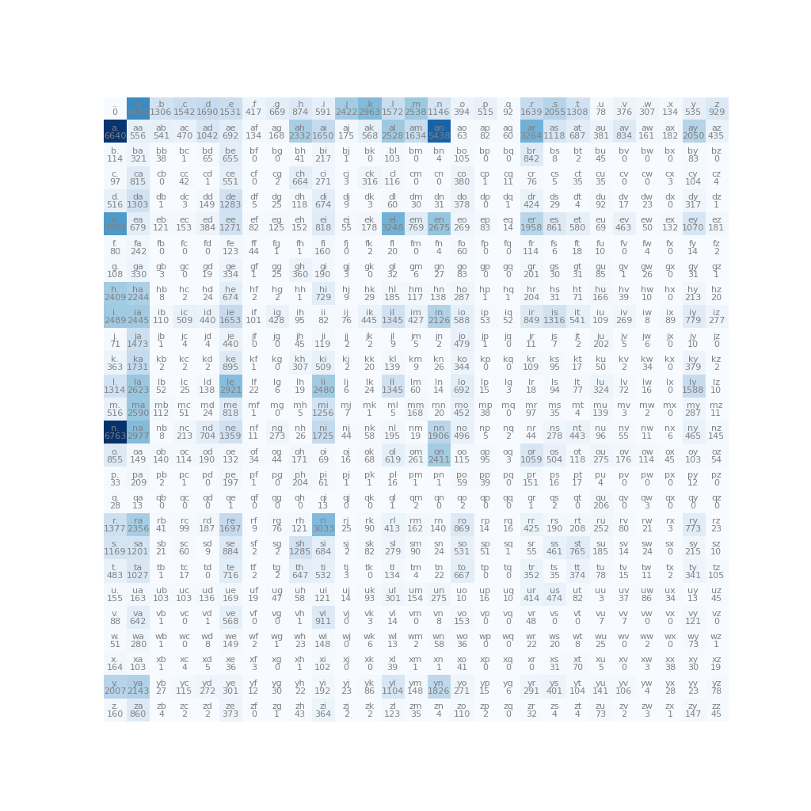

[](https://github.com/kfish/makemore-cpp-2023/actions/workflows/cmake.yml)

# makemore-cpp-2023

A C++ implementation of
[karpathy/makemore](https://github.com/karpathy/makemore).
Each step of the second episode of *Neural Nets: Zero to Hero*:
[The spelled-out intro to language modeling: building makemore](
https://youtu.be/PaCmpygFfXo)
is included.

 * [Bigram Language Model](#bigram-language-model)
   - [matplotlib-cpp](#matplotlib-cpp)
   - [Bigram Frequencies](#bigram-frequencies)
   - [Multinomial Sampler](#multinomial-sampler)
   - [Broadcasting Rules](#broadcasting-rules)

 * [The Neural Network Approach](#the-neural-network-approach)
   - [OneHot Encoding](#onehot-encoding)
   - [LogitLayer](#logitlayer)
   - [Smoothing](#smoothing)
   - [Sampling](#sampling)

## Bigram Language Model

### matplotlib-cpp

[kfish/matplotlib-cpp](https://github.com/kfish/matplotlib-cpp)

```bash
$ sudo apt update
$ sudo apt install python3 python3-dev python3-matplotlib
```

### Bigram Frequencies



### Multinomial Sampler

### Broadcasting Rules

[Reductions, visitors and Broadcasting](https://eigen.tuxfamily.org/dox/group__TutorialReductionsVisitorsBroadcasting.html)

## The Neural Network Approach

### OneHot Encoding

```c++
static inline Eigen::VectorXd encode_onehot(char c) {
    return OneHot(27, c_to_i(c));
}

static inline Eigen::MatrixXd encode_onehot(const std::string& word) {
    Eigen::MatrixXd matrix(word.size(), 27);

    for (size_t i = 0; i < word.size(); ++i) {
        matrix.row(i) = encode_onehot(tolower(word[i]));
    }

    return matrix;
}

```

We can encode the input string `".emma"` (including start token `'.'`)
and visualize this to make it a little more clear:

```c++
    std::string xs = ".emma";

    auto xenc = encode_onehot(xs);

    plt::imshow(xenc);
```


### LogitLayer

```c++
template <typename T, size_t Nin>
class LogitNeuron {
    public:
        LogitNeuron()
            //: weights_(randomArray<T, Nin>())
            : weights_(zeroArray<T, Nin>())
        {}

        Value<T> operator()(const std::array<Value<T>, Nin>& x) const {
            Value<T> zero = make_value<T>(0.0);
            Value<T> y = mac(weights_, x, zero);
            return expr(exp(y), "n");
        }

        void adjust(const T& learning_rate) {
            for (const auto& w : weights_) {
                w->adjust(learning_rate);
            }
        }

    private:
        std::array<Value<T>, Nin> weights_{};
};

template <typename T, size_t Nin, size_t Nout>
class LogitLayer {
    public:
        std::array<Value<T>, Nout> operator()(const std::array<Value<T>, Nin>& x) const {
            std::array<Value<T>, Nout> counts;
            std::transform(std::execution::par_unseq, neurons_.begin(), neurons_.end(),
                    counts.begin(), [&](const auto& n) { return n(x); });

            return norm(counts);
        }

        void adjust(const T& learning_rate) {
            for (auto & n : neurons_) {
                n.adjust(learning_rate);
            }
        }

    private:
        std::array<LogitNeuron<T, Nin>, Nout> neurons_{};
};

```
### LogitNode

```c++
template <size_t N, size_t M>
class LogitNode {
    public:
        LogitNode()
            : weights_(make_node(Eigen::MatrixXd(N, M)))
        {}           
        
        Node operator()(const Node& input) const {
            // input is a column vector; transpose it to a row vector to select a row of weights_
            return normalize_rows(exp(transpose(input) * weights_));
        }
            
        void adjust(double learning_rate) {
            weights_->adjust(learning_rate);
        }
            
    private:    
        Node weights_;
};      
```

### LogitMLP

```c++
template <size_t ContextLength, size_t N, size_t E, size_t H, size_t M>
class LogitMLP {
    public:
        LogitMLP()
            : C_(make_node(Eigen::MatrixXd(N, E))), 
            hidden_(make_node(Eigen::MatrixXd(ContextLength*E, H))),
            weights_(make_node(Eigen::MatrixXd(H, M))),
            bias_(make_node(Eigen::RowVectorXd(M)))
        {}
        
        Node operator()(const Node& input) const {
            return normalize_rows(exp(tanh(row_vectorize(input * C_) * hidden_) * weights_ + bias_));
        }
        
        void adjust(double learning_rate) {
            C_->adjust(learning_rate);
            hidden_->adjust(learning_rate);
            weights_->adjust(learning_rate);
            bias_->adjust(learning_rate);
        }

    private:
        Node C_;
        Node hidden_;
        Node weights_;
        Node bias_;
};

```

### Smoothing

Incentivize W to be near zero

square and sum all entries: zero loss if W near zero

### Sampling

Extract probability matrix, use multinomial sampler
