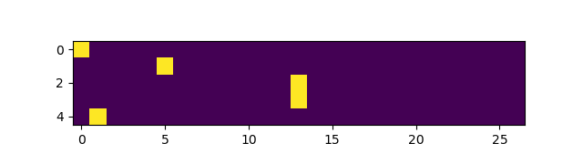

[](https://github.com/kfish/makemore-cpp-2023/actions/workflows/cmake.yml)

# makemore-cpp-2023

A C++ implementation of
[karpathy/makemore](https://github.com/karpathy/makemore).

Over a series of videos, episodes 2-5 of *Neural Nets: Zero to Hero*, Andrej Karpathy
details how to build a simple generative model.
This repository follows the thread of these videos, with the aim of developing a
corresponding platform in C++. This platform includes reusable code for:
  * building larger models that can be trained via backpropagation
  * visualization of matrices and plots of training data
  * training and sampling from models

These steps are essential for doing research on neural nets, so that the full cycle of
trying out ideas and evaluating them can be done with a few lines of code.

# Episode 1

*Building micrograd* spelled out backpropagation and training of neural nets.
I implemented a C++ version of that in
[kfish/micrograd-cpp-2023](https://github.com/kfish/micrograd-cpp-2023).

This repository (makemore-cpp-2023) continues on from there, expanding the automatically
differentiable `Value<T>` object to use vector and matrix operations.
This extension is crucial for applying automatic differentiation in a broader context.

# Episode 2


Each step of the second episode of *Neural Nets: Zero to Hero*:
[The spelled-out intro to language modeling: building makemore](
https://youtu.be/PaCmpygFfXo)
is included.

 * [Bigram Language Model](#bigram-language-model)
   - [matplotlib-cpp](#matplotlib-cpp)
   - [Bigram Frequencies](#bigram-frequencies)
   - [Multinomial Sampler](#multinomial-sampler)
   - [Broadcasting Rules](#broadcasting-rules)

 * [The Neural Network Approach](#the-neural-network-approach)
   - [OneHot Encoding](#onehot-encoding)
   - [LogitLayer](#logitlayer)
   - [Smoothing](#smoothing)
   - [Sampling](#sampling)

## Intro

makemore makes more of things like what you give it.
generate unique names, like what you give it

Generate sequences of characters

[names.txt](names.txt)

## Bigram Language Model

This section implements a Bigram Language Model using `matplotlib-cpp` for visualization. It involves calculating
bigram frequencies and developing a multinomial sampler.

Bigram language models are foundational tools in natural language processing that predict the probability of a word
based on the preceding word. They simplify the complexity of language by considering only immediate word pairs,
forming the basis for more complex language models.

Here we work with individual characters instead of words.
Working with just 2 characters at a time: given one character, what character is likely to follow.
Count how often one character follows another.

### Eigen

[Eigen](https://eigen.tuxfamily.org/index.php?title=Main_Page)
is a high-level C++ library for linear algebra, matrix and vector operations, and related mathematical computations.
It is used in this project for its efficiency in handling large-scale matrix operations.

[examples/bigram.cpp](examples/bigram.cpp)

### matplotlib-cpp

matplotlib-cpp is a C++ wrapper around the Python matplotlib library.

This allows us to use the same visualizations that the machine learning community uses
for research.

I've forked matplotlib-cpp with some small changes required:
[kfish/matplotlib-cpp](https://github.com/kfish/matplotlib-cpp)

In order to use this, you'll need to install some Python development packages, required for
linking C/C++ code against a Python interpreter:


```bash
$ sudo apt update
$ sudo apt install python3 python3-dev python3-matplotlib
```

Note that Python will only be used for visualization: the core neural net training and
sampling is all implemented in C++.

### Bigram Frequencies

Bigram frequencies refer to the counts of how often pairs of consecutive words occur in a given
dataset. This helps in calculating the probability of word sequences.

The most direct statistical model records how often pairs of letters occur

We can visualize the bigram tensor


### Multinomial Sampler

The C++ standard library provides soem basic types for random number generation and using probability distributions.

Using the C++ standard library for probability distributions offers reliability, efficiency, and integration
with the broader C++ ecosystem. It provides optimized routines for generating random numbers and sampling
from various distributions.

[std::discrete_distribution](https://en.cppreference.com/w/cpp/numeric/random/discrete_distribution)

```c++
class MultinomialSampler {
private:
    std::vector<std::discrete_distribution<int>> distributions; // Cached distributions
    std::mt19937 rng; // Random number generator

    // Cache discrete_distribution instances for each row of the probability matrix
    void cache_distributions(const Eigen::MatrixXd& prob_matrix) {
        for (int i = 0; i < prob_matrix.rows(); ++i) {
            Eigen::VectorXd row = prob_matrix.row(i); // Force evaluation into a dense vector
            std::vector<double> prob_vector(row.data(), row.data() + row.size());
            std::discrete_distribution<int> dist(prob_vector.begin(), prob_vector.end());
            distributions.push_back(dist);
        }
    }

public:
    // Constructor that takes a precalculated probability matrix
    MultinomialSampler(const Eigen::MatrixXd& prob_matrix)
        : rng(static_mt19937())
    {
        cache_distributions(prob_matrix);
    }

    // Operator to sample given a row index
    size_t operator()(size_t row_idx) {
        if (row_idx >= distributions.size()) {
            throw std::out_of_range("Row index out of bounds");
        }

        // Use the pre-cached distribution to sample and return column index
        return distributions[row_idx](rng);
    }
};
```

### Broadcasting Rules

Broadcasting rules in the context of this project refer to the automatic expansion of matrices or vectors
to compatible sizes during operations. This is crucial in matrix computations, particularly in neural
networks, where operations often involve matrices and vectors of different shapes.

[Reductions, visitors and Broadcasting](https://eigen.tuxfamily.org/dox/group__TutorialReductionsVisitorsBroadcasting.html)

### Loss function

The negative log likelihood is used as a loss function because it quantifies how well the model's predicted probabilities match the actual data, making it highly effective for training probabilistic models like those used in language processing.

The negative log likelihood is particularly useful because it penalizes incorrect predictions more heavily than other loss functions, leading to a more accurate and robust model, especially in scenarios like language modeling where probability distributions are key.

If the value of the matrix at each (prev, curr) character represents the likelihood that curr follows prev, then


```cpp

```

## The Neural Network Approach

We will gradually replace the bigram model with a neural net
longer context
eventually we want to predict based on long context


### OneHot Encoding

Onehot encoding is used for its simplicity and effectiveness in representing categorical data, like words in language modeling, as binary vectors.
This format is computationally efficient and simplifies the process of inputting data into neural network models.

Long vector, zeroes and one one in the location of the value

Operates as a selection vector (why ... move this later)

```c++
static inline Eigen::VectorXd encode_onehot(char c) {
    return OneHot(27, c_to_i(c));
}

static inline Eigen::MatrixXd encode_onehot(const std::string& word) {
    Eigen::MatrixXd matrix(word.size(), 27);

    for (size_t i = 0; i < word.size(); ++i) {
        matrix.row(i) = encode_onehot(tolower(word[i]));
    }

    return matrix;
}

```

We can encode the input string `".emma"` (including start token `'.'`)
and visualize this to make it a little more clear:

```c++
    std::string xs = ".emma";

    auto xenc = encode_onehot(xs);

    plt::figure_size(640, 180);
    plt::imshow(xenc);
```



### LogitLayer

First we want to implement using the Value<T> we developed in micrograd-cpp-2023

```c++
template <typename T, size_t Nin>
class LogitNeuron {
    public:
        LogitNeuron()
            //: weights_(randomArray<T, Nin>())
            : weights_(zeroArray<T, Nin>())
        {}

        Value<T> operator()(const std::array<Value<T>, Nin>& x) const {
            Value<T> zero = make_value<T>(0.0);
            Value<T> y = mac(weights_, x, zero);
            return expr(exp(y), "n");
        }

        void adjust(const T& learning_rate) {
            for (const auto& w : weights_) {
                w->adjust(learning_rate);
            }
        }

    private:
        std::array<Value<T>, Nin> weights_{};
};

template <typename T, size_t Nin, size_t Nout>
class LogitLayer {
    public:
        std::array<Value<T>, Nout> operator()(const std::array<Value<T>, Nin>& x) const {
            std::array<Value<T>, Nout> counts;
            std::transform(std::execution::par_unseq, neurons_.begin(), neurons_.end(),
                    counts.begin(), [&](const auto& n) { return n(x); });

            return norm(counts);
        }

        void adjust(const T& learning_rate) {
            for (auto & n : neurons_) {
                n.adjust(learning_rate);
            }
        }

    private:
        std::array<LogitNeuron<T, Nin>, Nout> neurons_{};
};

```
### LogitNode

Next we develop a Node class using Eigen matrices

```c++
template <size_t N, size_t M>
class LogitNode {
    public:
        LogitNode()
            : weights_(make_node(Eigen::MatrixXd(N, M)))
        {}           
        
        Node operator()(const Node& input) const {
            // input is a column vector; transpose it to a row vector to select a row of weights_
            return normalize_rows(exp(transpose(input) * weights_));
        }
            
        void adjust(double learning_rate) {
            weights_->adjust(learning_rate);
        }
            
    private:    
        Node weights_;
};      
```

### LogitMLP

Expand LogitNode to include extra weights and biases and tanh

```c++
template <size_t ContextLength, size_t N, size_t E, size_t H, size_t M>
class LogitMLP {
    public:
        LogitMLP()
            : C_(make_node(Eigen::MatrixXd(N, E))), 
            hidden_(make_node(Eigen::MatrixXd(ContextLength*E, H))),
            weights_(make_node(Eigen::MatrixXd(H, M))),
            bias_(make_node(Eigen::RowVectorXd(M)))
        {}
        
        Node operator()(const Node& input) const {
            return normalize_rows(exp(tanh(row_vectorize(input * C_) * hidden_) * weights_ + bias_));
        }
        
        void adjust(double learning_rate) {
            C_->adjust(learning_rate);
            hidden_->adjust(learning_rate);
            weights_->adjust(learning_rate);
            bias_->adjust(learning_rate);
        }

    private:
        Node C_;
        Node hidden_;
        Node weights_;
        Node bias_;
};

```

### Smoothing

Incentivize W to be near zero

square and sum all entries: zero loss if W near zero

### Sampling

General class for sampling from a model
Usable on any model based on Node

```c++
template <typename F>
class ModelSampler {
    private:
        std::mt19937 rng; // Random number generator
    
    public:
        // Constructor that takes a precalculated probability matrix
        ModelSampler(const F& func)
            //: rng(std::random_device{}())
            : rng(static_mt19937()), func_(func)
        {}  
        
        // Operator to sample given input
        template <typename Input>
        size_t operator()(const Input& input) {
            Node input_node = make_node(input);
            Node output = func_(input_node);
            Eigen::RowVectorXd row = output->data();
            std::vector<double> prob_vector(row.data(), row.data() + row.size());
            std::discrete_distribution<int> dist(prob_vector.begin(), prob_vector.end());
            return dist(rng);
        }

    private:
        const F& func_;
};      
```


